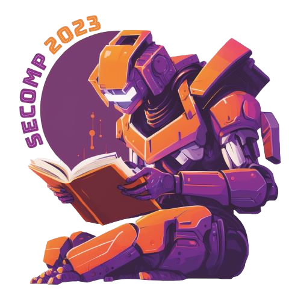

<!-- _backgroundColor: #11111111 -->
<!-- _color: #DEDEDE -->
<!-- _header: '' -->
<!-- _footer: '' -->
<!-- _paginate: false -->

# A linguagem Rust e abstrações de alto nível

## SECOMP 2023
### Brenno Lemos

- [ Syndelis](https://github.com/Syndelis)
- [ @brenno@fosstodon.org](https://fosstodon.org/@brenno)




---

# Antes de mais nada

## Instale Rust e participe do *live-coding*

```sh
$ curl https://sh.rustup.sh | sh
```


---

# Por quê Rust?

- Padrão único de organização estrutural;
- Possui um gerenciador de pacotes oficial;
- Impossibilita* condições de corrida e vazamento de memória;
- É o inimigo № 1 do *Segmentation Fault*;


---

# Exemplo: Gerencimanto de Memória Automático

<div class="columns">
<div>

## C

```c
#include <stdlib.h>
int main() {
    // Alocamos o vetor
    int *vec = (int*) malloc(
        50 * sizeof(int)
    );

    // Usamos o vetor...
    usa_vetor(vec);

    // Liberamos a memória
    free(vec);
}
```

</div>

<div>

## Rust

```rs
fn main() {
    // Alocamos o vetor
    let vec: Vec<i32> = Vec::new();

    // Usamos o vetor...
    usa_vetor(&vec);

    // O vetor é liberado
    // automaticamente
}
```

</div>

---

# Índice - O que vamos aprender

1. A sintaxe de Rust;
    - Comparando com C e Python;
2. Sistema de posse e empréstimo
    (*ownership & borrowing system*);
3. Estruturas e traços
    (*structs & traits*);
4. Implementação "cobertor"
    (*blanket trait implementation*);

