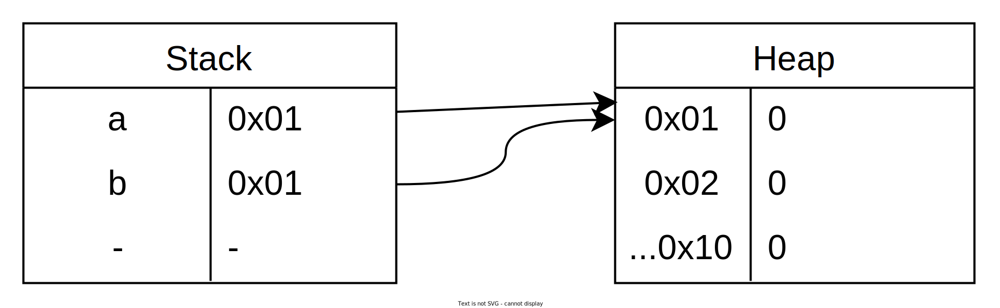

<!-- _header: '' -->
<!-- _footer: '' -->
<!-- _paginate: false -->

# A linguagem Rust e abstrações de alto nível

## SECOMP 2023
### Brenno Lemos

- [ Syndelis](https://github.com/Syndelis)
- [ @brenno@fosstodon.org](https://fosstodon.org/@brenno)


---

# Antes de começarmos

## Instale Rust para fazer os exercícios

```sh
$ curl https://sh.rustup.sh | sh
```


---

# Por que Rust?

- Padrão único de organização estrutural;
- Possui um gerenciador de pacotes oficial;
- Impossibilita* condições de corrida e vazamento de memória;
- É o inimigo № 1 do *Segmentation Fault*;
  - **Segurança e Confiabilidade** 🤝


---

# Exemplo: Gerencimanto de Memória Automático

<div class="columns">
<div>

## C

```c
#include <stdlib.h>
int main() {
    // Alocamos o vetor
    int *vec = (int*) malloc(
        50 * sizeof(int)
    );

    // Usamos o vetor...
    usa_vetor(vec);

    // Liberamos a memória
    free(vec);
}
```

</div>

<div>

## Rust

```rs
fn main() {
    // Alocamos o vetor
    let vec: Vec<i32> = Vec::new();

    // Usamos o vetor...
    usa_vetor(&vec);

    // A memória é liberada
    // automaticamente
}
```

</div>

---

# Índice - O que vamos aprender

1. A Sintaxe de Rust;
    - Comparando com C e Python;
2. Sistema de posse e empréstimo
    (*ownership & borrowing system*);
3. Estruturas, enumeradores e implementações
    (*structs, enums & impl*);
4. Traços (*traits*);
5. Monomorfismo e Polimorfismo;


---

# 1. Um Resumo da Sintaxe

<div class="columns">
<div>

- Similar ao C;
- Parênteses são opcionais e desencorajados;
- `for` genérico ao invés de numérico;
- `return` opcional na maioria dos casos;
- Tipagem pós-fixada ao invés de prefixada;
- Macros explícitos com `!`;

</div>

<div style="font-size: 2em">

```rust
fn cinco_ou_maior(x: i32) -> i32 {
  if x > 5 { x } else { 5 }
}
```

```rust
fn main() {
  for i in 0..10 {
    println!(
      "Valor: {}",
      cinco_ou_maior(i)
    );
  }
}
```

</div>
</div>

---

<!-- _header: '' -->
<!-- _footer: '' -->

# 1.1. Declaração de variáveis

<div class="columns">
<div>

- Declaradas com `let`;
- Apesar do nome, não são sempre "variáveis";
  - Por padrão, são **imutáveis**;
- Opcionalmente **mutáveis** com `mut`;
- Podem ser "redefinidas", criando uma nova variável com o mesmo identificador;
  - Dizemos que a variável foi "sombreada" (*shadowed*);
- Tipos podem ser omitidos se *inferíveis*;

</div>

<div>

<div>

## Inválido —

</div>

<div style="font-size: 1.5em">

```rust
let x = 10;
x = 20; // Erro!
x += 1; // Erro!
```

</div>

## Válido —

<div class="columns" style="font-size: 2em">

```rust
let mut x = 10;
x = 20;
x += 1;
```

```rust
let x = 10;
let x = 20;
let x = x + 1;
```

</div>

</div>

</div>
</div>

---

# Exercício 1: Caixa eletrônico

Dado um valor inteiro X que o usuário deseja sacar, imprima no terminal a quantidade de notas de cada valor para que o saque seja realizado. Considere os valores de notas do Brasil: R$ **200**, R$ **100**, R$ **50**, R$ **20**, R$ **10**, R$ **5** e R$ **2**.

<div class="unequal-columns">

<div class="column-34">

### Lendo valores do terminal

```rust
fn main() {
  let mut ent = String::new();
  std::io::stdin().read_line(&mut ent);

  let x: i32 = ent.trim().parse().unwrap();

  println!("Você digitou {x}");
}
```

</div>

<div class="column-14">

### Compile e Execute

```sh
$ rustc caixa.rs
$ ./caixa
```

</div>

</div>

---

# Apêndice 1.1: Sobre leitura de dados do terminal

Por que tantos comandos foram usados para ler um inteiro do terminal?

<div class="unequal-columns">

<div class="column-23">

```rust
// Rust
fn main() {
  let mut ent = String::new();
  std::io::stdin().read_line(&mut ent);

  let x: i32 = ent.trim().parse().unwrap();

  println!("Você digitou {x}");
}
```

</div>

<div class="column-13">

```c
// C
#include <stdio.h>
int main() {
  int x;
  scanf("%d", &x);

  printf("Você digitou %d\n", x);

}
```

</div>

</div>

---

# Apêndice 1.1: Simples, Segurança!

```c
// C
#include <stdio.h>
int main() {
  int x;

  // Em caso de erro, `scanf` retorna `1` e coloca `0` no valor
  // da variável
  scanf("%d", &x);

  printf("Você digitou %d\n", x);

}
```


```sh
❯ gcc scanf-test.c -o scanf-test
❯ ./scanf-test
asd
Você digitou 0
```

---

# Apêndice 1.1.1: Quando estiver desenvolvendo em **C**, leia o manual!

```sh
$ man scanf
```

> **SYNOPSIS**
  `#include <stdio.h>`
  `int scanf(const char *restrict format, ...);`


> **RETURN VALUE**
  On success, these functions return the number of input items successfully matched and  assigned;  this can be fewer than provided for, **or even zero, in the event of an early matching failure.**

---

<!-- _footer: '' -->

# Apêndice 1.2: Macros explícitos? Por quê?

Neste ponto do curso você deve estar se perguntando por que que para imprimir no terminal usamos uma "função" que tem um `!` no nome.

Diferentemente de `printf` do C, `println!` é um macro, e em Rust, macros (macro-funções, mais especificamente) são pós-fixados de `!`.

Para entender o porquê, vejamos esse exemplo de código em C e sua saída.

```c
#include <stdio.h>
#include <stdlib.h>

#define max(a, b) (a) > (b) ? (a) : (b)

int main() {
    for (int i = 0; i < 10; i++)
        printf("%d\n", max(rand()%10, 5));
}
```

---

# 2. Posse vs. Empréstimo

- Um dos aspectos mais complicados para iniciantes na linguagem;
- É a "magia" por trás da segurança de Rust;

<div style="font-size: 1.55em">

```rust
let x = vec![1, 2, 3]; // Dono do dado
let y = x; // Passagem de posse

let a = &x[0]; // Erro! `x` não é mais dona do dado!
```

```rust
let x = vec![1, 2, 3];
let y = &x; // Empréstimo

let a = &x[0]; // OK
```

</div>

---

<!-- _header: '' -->
<!-- _footer: '' -->

# 2.1. Comparativo com **C**: Por que **Rust** é chato sobre posse e empréstimo?

Você consegue dizer qual linha causará um erro?

<div class="unequal-columns">

<div class="column-34" style="font-size: 3rem">

```c
#include <stdio.h>
#include <stdlib.h>

int main() {
  int *a = (int*)malloc(sizeof(int) * 10);
  int *b = a;

  free(a);

  printf("%d\n", a[5]);
  b[9] = 10;
  printf("%d\n", b[9]);

  free(b);
}
```

</div>

<div class="column-14">

## Responda <br> aqui


Ou no link:

<div style="font-size: 0.4em">

[secomp.brenno.codes/question/c-segfault](https://secomp.brenno.codes/question/c-segfault)

</div>

</div>
</div>

---



---

# Exercício 2: Caixa eletrônico com notas faltantes

Baseando-se no exerício 1, altere o código do seu caixa eletrônico e remova as notas de R$ 100 e R$ 10 reais.

Sempre que o programa começar, avise ao usuário quais são as notas disponíveis.

Use funções para listar as notas disponíveis e para calcular as notas usadas no saque.

---

# 2.2. Empréstimo Único vs. Empréstimo Compartilhado

- ## Temos duas formas de emprestar valores em Rust;
  - ### `&` são referências imutáveis (ou compartilhadas);
  - ### `&mut` são refernências mutáveis (ou únicas);
- ## É permitido que existam, ao mesmo tempo, **infinitas** referências compartilhadas **ou** **uma** referência única;
- Por quê? Para evitar **condições de corrida** em ambientes **paralelizados**;

---

# 3. Estruturas e Implementações

- Estruturas nos permitem agrupar e armazenar dados de maneira arbitrária;

<div class="unequal-columns">

<div class="column-23" style="font-size: 2em">

```rust
struct Cpf([u8; 11]);

struct Pessoa {
  nome: String,
  cpf: Cpf,
}
```

</div>

<div class="column-13">

- Dizemos que `Cpf` é uma
"estrutura-tupla" (*tuple-struct*);
  - `Cpf` possui um array de 11
  elementos inteiros sem sinal
  de 8 bits;

</div>

</div>

---

<!-- _header: '' -->

# 3.1. Implementações

Implementações nos permitem associar código a determinadas estruturas. Você pode pensar em implementações como paralelos a métodos em linguagens Orientadas a Objetos; a diferença é que estrutura e código são definidos em blocos diferentes.

<div class="columns">

<div style="font-size: 1.5em">

```rust
struct Pessoa {
  nome: String,
  sobrenome: String,
}
```

</div>

<div style="font-size: 1.2em">

```rust
impl Pessoa {
  fn nome_completo(
    &self
  ) -> String {
    format!("{} {}",
      self.nome,
      self.sobrenome
    )
  }
}
```

</div>
</div>

---

# Exercício 3: TODO

---

# 3.2. Enumeradores

Em Rust, o `enum` é o que chamamos de união discriminada (*tagged union*). Com ele, é possível definir não somente um nome para um valor constante, mas também incluir valores nas variantes do enumerador.

```rust
enum FormaGeometrica {
  Circulo { raio: f32 },
  Quadrado { lado: f32 },
  Retangulo { altura: f32, largura: f32 },
}
```

---

# 3.2. Acessando enumeradores

<div class="unequal-columns">

<div class="column-23">

```rust
fn main() {
  let mut entrada = String::new();
  let stdin = std::io::stdin();

  stdin.read_line(&mut entrada);

  let x = entrada.trim().parse::<i32>();

  match x {
    Ok(x) => println!("x é {x}"),
    Err(e) => println!("Erro: {e}"),
  }
}
```

</div>

<div class="column-13" style="text-align: justify">

Antes de acessarmos o
valor de um enum, é
necessário discriminar
a variante.

Podemos fazer isso de
várias maneiras, sendo
a mais comum com o
comando `match`.

</div>

</div>

---

# *Mini* Exercício 4: Calculando a área das figuras geométricas

TODO

---

<!-- _header: '' -->
<!-- _footer: '' -->

# Apéndice 3.1: *Tagged Unions* em C e C++

<div class="columns">

<div>

### **C**

```c
#include <stdio.h>

typedef struct {
  enum { RETANGULO, QUADRADO, CIRCULO } tipo;
  union {
    struct { float altura, largura; } retangulo;
    struct { float lado; } quadrado;
    struct { float raio; } circulo;
  };
} FiguraGeometrica;

int main() {
  FiguraGeometrica fig = {
    .tipo = QUADRADO,
    .quadrado = { .lado = 2.0 }
  };

  printf("%.2f\n", fig.quadrado.lado);
}
```

</div>

<div>

### **C++17**

```cpp
#include <iostream>
#include <variant>

struct Retangulo { int largura, altura; };
struct Quadrado { int lado; };
struct Circulo { int raio; };

using FiguraGeometrica = std::variant<
  Retangulo, Quadrado, Circulo
>;

int main() {
  auto fig = FiguraGeometrica {
    Retangulo { .largura = 10, .altura = 20 }
  };

  std::cout
  << "largura: "
  << std::get<Retangulo>(fig).largura
  << std::endl;
}
```

</div>

</div>

---

# 4. Traços

Como vimos anteriormente, Rust não é uma linguagem Orientada a Objetos. Contudo, ela oferece um recurso familiar aos programadores **OO** para a reutilização de código (*dentro de inúmeras outras funções*): os traços.

Traços descrevem uma série de métodos que devem ser implementados por uma **struct** ou **enum**. 

---

<!-- _header: '' -->
<!-- _footer: '' -->

# 4.1. O esqueleto de um traço

<div class="columns">

<div>

```rust
trait Animal {
  fn ameacar(&self);
}

struct Cachorro;

struct Gato;

impl Animal for Cachorro {
  fn ameacar(&self) {
    println!("Grrr");
  }
}

impl Animal for Gato {
  fn ameacar(&self) {
    println!("Hiss");
  }
}
```

</div>

<div>

```rust
fn main() {
  let c = Cachorro;
  let g = Gato;

  c.ameacar();
  g.ameacar();
}
```

</div>

</div>


---

# 4.2. Implementações padrão

Traços também podem provir implementações padrão para os métodos especificados, de tal forma que não seja necessário re-implementá-los para todas as estruturas que quiserem implementá-los.

```rust
trait Animal {
  fn ameacar(&self);
  fn ameacar_e_atacar(&self) {
    self.ameacar();
    println!("Slash!");
  }
}
```

Neste exemplo, tanto as estruturas `Cachorro` e `Gato` terão o método `.ameacar_e_atacar` auto-definido.

---

# 4.3. Macros `derive`

<!-- _header: '' -->

Vimos previamente que funções pós-fixadas com `!` são funções-macro. Em Rust, 3 tipos de macro existem, no total, sendo um dos mais importantes o `derive`.

<div class="columns">

<div>

```rust
fn main() {
  let c = Carro {
    modelo: "Fusca",
    numero_portas: 2
  };

  dbg!(c); // Imprime `Carro { ... }`
}

#derive[Debug]
struct Carro {
  modelo: String,
  numero_portas: i32,
}
```

</div>

<div>

Estes macros comumente são utilizados para prover funcionalidades trivialmente implementáveis. Exemplos:

- `Debug`: Possibilita impressão dos dados da estrutura;
- `Eq`: Possibilita comparação de igualidade entre estruturas;
- `Hash`: Possibilita que a estrutura seja usada como chave de `HashMap`;

</div>

</div>

---

# *Mini* Exercício 5: Printando nossa estrutura com `Display` e `Debug`

Faça uma estrutura que represente um aluno, com pelo menos 3 campos de tipos diferentes. Utilize o `derive` para implementar `Debug` na estrutura e realizar a impressão de depuração.

Após isso, implemente `Display` para definir como um aluno deve ser apresentado no SIGAA. Siga este template para a impressão:

```
Olá, {aluno.nome}. Sua matrícula é {aluno.matricula}.
```
